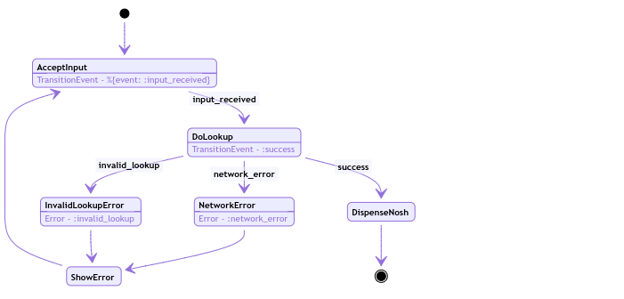
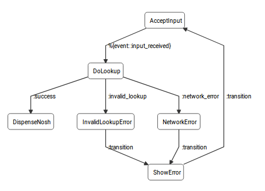
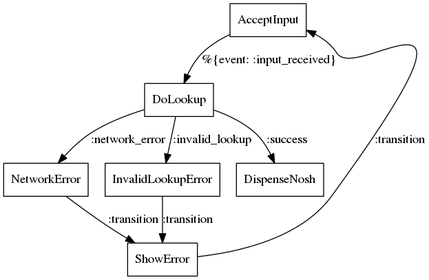

# StatesLanguage

Declaratively design state machines that compile to Elixir based `:gen_statem` processes with the [States Language](https://states-language.net/spec.html) JSON specification.

## About
States Language is the JSON specification behind [AWS Step Functions](https://aws.amazon.com/step-functions/), a powerful way to coordinate many disparate services into a cohesive "serverless" system. This library uses the same JSON specification and compiles to Elixir based [gen_statem](http://erlang.org/doc/design_principles/statem.html) processes.

The initial idea for the Elixir implementation came about while working on an IVR system and we wanted a way to describe "call flows" in a declarative manner. Ideally building a system on top to allow for solution engineers to visually build call flows for a client, without writing any code. After researching the space a bit, we landed on the [States Language](https://states-language.net/spec.html) spec and decided it was a great fit for describing state machines. With the power of Elixir macros in-hand, this library was born.

## Getting Started

### Adding StatesLanguage to your project

Add `StatesLanguage` as a dependency to your mix.exs file.

```elixir
defp deps do
  [{:states_language, "~> 0.4.0"}]
end
```

## Usage

For those unfamiliar with state machines, a vending machine is an often used example, so we're going to stick with that for our walk-through of how to use this library. For a more detailed description of state machines see the [wikipedia article](https://en.wikipedia.org/wiki/Finite-state_machine).

For the sake of brevity, we're alo going to assume that the vending machine has already accepted the money and is now waiting for someone to hit the correct buttons in the correct order to dispense the nosh.

#### Nosh
> A snack or light meal.

Let's start with a diagram of our system.



There's only a few states to deal with here, so let's get started.

Let's start by creating the States Language JSON description, name it `vending_machine.json`

```json
{
  "Comment": "Dispense with the nosh",
  "StartAt": "AcceptInput",
  "States": {
    "AcceptInput": {
      "Type": "Task",
      "Resource": "StartKeyPad",
      "TransitionEvent": "%{event: :input_received}",
      "Next": "DoLookup"
    },
    "DoLookup": {
      "Type": "Task",
      "Resource": "DoLookup",
      "TransitionEvent": ":success",
      "InputPath": "$.:keypad",
      "Parameters": {
        "keyed_input.$": "$.:input"
      },
      "Next": "DispenseNosh",
      "Catch": [
        {
          "ErrorEquals": [":invalid_lookup"],
          "Next": "InvalidLookupError"
        },
        {
          "ErrorEquals": [":network_error"],
          "Next": "NetworkError"
        }
      ]
    },
    "NetworkError": {
      "Type": "Task",
      "Resource": "SetError:Network Error. Please try again",
      "Next": "ShowError"
    },
    "InvalidLookupError": {
      "Type": "Task",
      "Resource": "SetError:That was not a correct nosh code, please try again",
      "Next": "ShowError"
    },
    "ShowError": {
      "Type": "Task",
      "Resource": "DisplayText:error",
			"Next": "AcceptInput"
    },
    "DispenseNosh": {
      "Type": "Task",
      "Resource": "DispenseNosh",
      "End": true
    }
  }
}
```

## State Fields

We can see each state from our diagram represented, and a few mentions of "TransitionEvent". You can see that those events look eerily like Elixir maps and atoms. The library will evaluate these strings into their Elixir equivalent to do some fun pattern matching. One thing to note is that we can't use ambiguous matching, we have to be explicit. For example, in our `AcceptInput` transition event, we couldn't do something like `%{event: my_event}`. It has to be an atom or something that can be evaluated at compile time `%{event: :clicked}`, string, integer, etc.

### TransitionEvent

You may notice that a few of our states are without the `TransitionEvent` field. The library will provide a default transition event of `:transition`. We'll see more about that when we go over the Elixir code that implements our machine. It's worth noting that `TransitionEvent` isn't in the [States Language spec](https://states-language.net/spec.html), but I've found it quite a powerful addition. For example, this allows external processes to send events to the state machine, without us having to write listener/translation code for every possible event. We just say, when you receive this event, transition to the next state.

**Note** 

The mix of JSON decoding and `Code.eval_string` makes it a bit tricky to use just a plain string as an event, however it is possible. In your JSON file, you can use a sigil and escaped string like so `"TransitionEvent": "\"~s(my_event)\""`.

### Resource

The `Resource` field is where we tell the state machine what "function" to call when we enter that state, the "Resource" is also what's responsible for telling the state machine to transition, returning `{:next_event, :internal, :transition}` or whatever we've declared our transition event to be, or not, transition events can come from anywhere. Since under the hood we are using `:gen_statem` we can return whatever actions are supported by it, timeouts, postpone, hibernate etc. The [:gen_statem docs](http://erlang.org/doc/man/gen_statem.html#type-action) for actions can be very helpful.

### Type

The `Type` field is very important. This tells us what type of state we are, and each one gets processed a bit different. Currently supported types are [Task](https://states-language.net/spec.html#task-state), [Map](https://states-language.net/spec.html#map-state), [Parallel](https://states-language.net/spec.html#parallel-state), [Choice](https://states-language.net/spec.html#choice-state) and [Wait](https://states-language.net/spec.html#wait-state). The spec does list a few other types, [Pass](https://states-language.net/spec.html#pass-state), [Fail](https://states-language.net/spec.html#fail-state) and [Succeed](https://states-language.net/spec.html#succeed-state) types. The "Map" and "Parallel" types differ a bit from the spec, for the Elixir version, we actually set the `branch` or `iterator` to a module name, rather than putting the embedded logic in the parent state machine. You can check out the JSON for those tests [here](https://github.com/CityBaseInc/states_language/blob/master/test/support/states_language_test_map.json). See the guides for an example of using the Map type.

### Next

The `Next` field is pretty self-explanatory. Upon receiving a `TransitionEvent` event or `:transition` it transitions the state machine to the next state.

### Catch

The `Catch` field allows us to "catch" errors and move to an error state. The same principles apply to these events as with our transition events, must be able to evaluate at compile time. Notice that `ErrorEquals` is an array, so it's possible to list multiple error events and transition to the same state. `Catch` itself is also an array, so you can transition to multiple states depending on the type of error. I find this useful for states that may be reaching out to external resources and there are several possible failure modes.

### End

`End` is another self-explantory field. After processing the `Resource` no matter what the result, we `:stop` the `:gen_statem` process. The `handle_termination/3` callback will be called for final cleanup.

## JSONPath

`InputPath`, `Parameters`, `ResourcePath` and `OutputPath` all use JSONPath to mutate the incoming and outgoing data. 

### InputPath

`InputPath` is used to select a field from the incoming data, they can be atom keys or string keys, as well as array indexes such as `[1]`. For atom keys, you need to prepend the key with `:` for strings, just the key name. 

### Parameters

`Parameters` allow you to pass in default values as well as select data from the `InputPath` selection. It's worth noting that if none of the paths are provided they default to `$` which essentially just passes the incoming data to the resource untouched. 

### ResourcePath

`ResourcePath` allows you to select keys or array indexes from the result to pass to the next state. 

### OutputPath

`OutputPath` will create new nested keys in the result to pass to the next state. 

In practice we don't generally use the path support often and instead just pass a struct through to each state, building up our data (state) as we move through each state, this is similar to how Plug uses the connection struct. The path support is definitely helpful when talking to external services that you don't control, and the output of one resource needs to be mutated into a different structure for the next resource.

## State Machine Module

Now let's create our module implementation, name it `vending_machine.ex`.

**Note** If you are following along by creating your own mix project, you'll need to update the `@external_resource` and `data` variables on lines 2 and 3, to point to the JSON file you created above.

```elixir
defmodule VendingMachine do
  use StatesLanguage, data: "test/support/vending_machine.json"

  defmodule Data do
    defstruct keypad: %{input: ""}, lookup: %{result: nil}, error: "", test: nil
  end

  @impl true
  def handle_resource("StartKeyPad", _params, "AcceptInput", %StatesLanguage{} = sl) do
    me = self()
    # Let's pretend someone is pushing keys, see the `handle_info` callback below for how these are handled.
    Task.start(fn ->
      send(me, {:keypress, "a"})
      send(me, {:keypress, "1"})
      send(me, {:keypress, "2"})
      send(me, {:keypress, "3"})
    end)

    {:ok, sl, []}
  end

  @impl true
  def handle_resource(
        "DoLookup",
        %{"keyed_input" => code},
        "DoLookup",
        %StatesLanguage{data: %Data{} = data} = sl
      ) do
    debug("Looking up code #{code}")

    {data, actions} =
      case lookup(code) do
        {:ok, result} ->
          {%Data{data | lookup: %{result: result}}, [{:next_event, :internal, :success}]}

        {:error, :network} ->
          {data, [{:next_event, :internal, :network_error}]}

        {:error, :no_result} ->
          {data, [{:next_event, :internal, :lookup_error}]}
      end

    {:ok, %StatesLanguage{sl | data: data}, actions}
  end

  @impl true
  def handle_resource(
        <<"SetError:", error::binary>>,
        _params,
        _any_state,
        %StatesLanguage{data: %Data{} = data} = sl
      ) do
    {:ok, %StatesLanguage{sl | data: %Data{data | error: error}},
     [{:next_event, :internal, :transition}]}
  end

  @impl true
  def handle_resource(
        <<"DisplayText:", key::binary>>,
        _params,
        "ShowError",
        %StatesLanguage{data: %Data{} = data} = sl
      ) do
    key = String.to_existing_atom(key)
    text = Map.get(data, key)
    Logger.info("Displaying Text: #{text}")
    {:ok, sl, [{:next_event, :internal, :transition}]}
  end

  @impl true
  def handle_resource(
        "DispenseNosh",
        _params,
        "DispenseNosh",
        %StatesLanguage{data: %Data{} = data} = sl
      ) do
    Logger.info("Dispensing one #{inspect(data.lookup.result.candy)}")
    {:ok, sl, []}
  end

  @impl true
  def handle_info({:keypress, digit}, "AcceptInput", %StatesLanguage{data: %Data{} = data} = sl) do
    input = data.keypad.input
    input = input <> digit

    actions =
      if String.length(input) > 3 do
        [{:next_event, :internal, %{event: :input_received}}]
      else
        []
      end

    {:ok, %StatesLanguage{sl | data: %Data{data | keypad: %{input: input}}}, actions}
  end

  @impl true
  def handle_termination(_, _, %StatesLanguage{data: %Data{} = data}) do
    send(data.test, :finished)
    :ok
  end

  defp lookup(1_234_556), do: {:error, :no_result}
  defp lookup(11_111_111), do: {:error, :network}

  defp lookup(_code) do
    {:ok, %{candy: "Snickers"}}
  end
end
```


If you've checked out the StatesLanguage repo, you can run this code by running `$ MIX_ENV=test mix test test/states_language_vending_machine_test.exs --force` from your CLI.

If you are building your own project you can run it like this.

```bash
$ iex -S mix
iex(1)> VendingMachine.start_link(%VendingMachine.Data{test: self()})
iex(2)> flush()
:finished
:ok
```

Which should result in output that looks like this.

```
$ MIX_ENV=test mix test test/states_language_vending_machine_test.exs --force
Compiling 14 files (.ex)
Generated states_language app

14:41:21.827 [debug] Elixir.VendingMachine - Init: Data - %VendingMachine.Data{error: "", keypad: %{input: ""}, lookup: %{result: nil}, test: #PID<0.285.0>} Actions - [{:next_event, :internal, :handle_resource}]

14:41:21.828 [debug] Elixir.VendingMachine - left "AcceptInput" --> "AcceptInput": %StatesLanguage{_parent: nil, _parent_data: nil, _supervisor: nil, _tasks: [], data: %VendingMachine.Data{error: "", keypad: %{input: ""}, lookup: %{result: nil}, test: #PID<0.285.0>}}

14:41:21.833 [debug] Elixir.VendingMachine - Handled info event: {:keypress, "a"} in state AcceptInput with data %StatesLanguage{_parent: nil, _parent_data: nil, _supervisor: nil, _tasks: [], data: %VendingMachine.Data{error: "", keypad: %{input: "a"}, lookup: %{result: nil}, test: #PID<0.285.0>}}

14:41:21.833 [debug] Elixir.VendingMachine - Handled info event: {:keypress, "1"} in state AcceptInput with data %StatesLanguage{_parent: nil, _parent_data: nil, _supervisor: nil, _tasks: [], data: %VendingMachine.Data{error: "", keypad: %{input: "a1"}, lookup: %{result: nil}, test: #PID<0.285.0>}}

14:41:21.833 [debug] Elixir.VendingMachine - Handled info event: {:keypress, "2"} in state AcceptInput with data %StatesLanguage{_parent: nil, _parent_data: nil, _supervisor: nil, _tasks: [], data: %VendingMachine.Data{error: "", keypad: %{input: "a12"}, lookup: %{result: nil}, test: #PID<0.285.0>}}

14:41:21.833 [debug] Elixir.VendingMachine - Handled info event: {:keypress, "3"} in state AcceptInput with data %StatesLanguage{_parent: nil, _parent_data: nil, _supervisor: nil, _tasks: [], data: %VendingMachine.Data{error: "", keypad: %{input: "a123"}, lookup: %{result: nil}, test: #PID<0.285.0>}}

14:41:21.833 [debug] Elixir.VendingMachine - got internal event %{event: :input_received} in state "AcceptInput" transitioning to "DoLookup"

14:41:21.833 [debug] Elixir.VendingMachine - left "AcceptInput" --> "DoLookup": %StatesLanguage{_parent: nil, _parent_data: nil, _supervisor: nil, _tasks: [], data: %VendingMachine.Data{error: "", keypad: %{input: "a123"}, lookup: %{result: nil}, test: #PID<0.285.0>}}

14:41:21.862 [debug] Elixir.VendingMachine - Looking up code a123

14:41:21.862 [debug] Elixir.VendingMachine - got internal event :success in state "DoLookup" transitioning to "DispenseNosh"

14:41:21.863 [debug] Elixir.VendingMachine - left "DoLookup" --> "DispenseNosh": %StatesLanguage{_parent: nil, _parent_data: nil, _supervisor: nil, _tasks: [], data: %VendingMachine.Data{error: "", keypad: %{input: "a123"}, lookup: %{result: %{candy: "Snickers"}}, test: #PID<0.285.0>}}

14:41:21.863 [info]  Dispensing one "Snickers"

14:41:21.863 [debug] Elixir.VendingMachine - Terminating in state DispenseNosh :normal
```

## Persisting process state

It's also possible to override the "Start" state and perhaps pass in a deserialized data object. This would allow you to persist the StatesLanguage process to storage and restart the process where you left off.

For the vending machine example you could pass in your data and a `start` parameter to `start_link` or `start`

```bash
$ iex -S mix
iex(1)> data = %Data{test: self(), keypad: %{input: "a123"}, lookup: %{result: %{candy: "Snickers"}}}
iex(2)> VendingMachine.start_link(data, start: "DispenseNosh")
iex(3)> flush()
:finished
:ok
```

And your output would look something like this

```
09:19:04.239 [debug] Elixir.VendingMachine - Init: Data - %VendingMachine.Data{error: "", keypad: %{input: "a123"}, lookup: %{result: %{candy: "Snickers"}}, test: #PID<0.346.0>}

09:19:04.239 [warn]  Unknown enter event from "DispenseNosh" to "DispenseNosh"

09:19:04.239 [info]  Dispensing one "Snickers"

09:19:04.239 [debug] Elixir.VendingMachine - Terminating in state DispenseNosh :normal
```

## Validation

The library also includes JSON Schemas to validate that your state machines are valid States Language JSON data. 

Validation is automatically done at compile time, and will `throw({:error, error_map})` if the data does not pass validation.

The StatesLanguage library uses [json_xema](https://hexdocs.pm/json_xema/api-reference.html) for validation. The schema files are available in [priv/schemas](https://github.com/CityBaseInc/states_language/tree/master/priv/schemas)

It's useful to test your state machines in your test phase which is possible by calling `StatesLanguage.validate(my_state_machine_map)`

The function expects a map, so make sure to deserialize your data first.

## Serialization

One of the main benefits of describing your state machines in JSON is the interoperability of the format. This library is obviously all Elixir, but there are many use cases where you may want to share the state machine specification. Something like a visual editor.


### Mix Tasks

There are 2 mix tasks included to quickly output serialized graphs for the [Graphviz](https://graphviz.org/) Dot format and the D3 Graph format.

`mix states_language.dot` and `mix states_language.d3` respectively.

To quickly view a graph visually, assuming you have Graphviz installed with the `dot` program you can run this.

```
$ mix states_language.dot test/support/vending_machine.json > ~/Desktop/vending_machine.dot
$ dot -Tpng ~/Desktop/vending_machine.dot -o ~/Desktop/vending_machine.png
```

Which should result in a .png file that looks like this.



### Serializer Modules

You can also use the serializers in your own applications.

This example is using the `StatesLanguage.Serializer.D3Graph` to serialize the graph structure to something compatible with [D3](https://d3js.org/) and [DagreD3](https://github.com/dagrejs/dagre-d3).

The initial graph for our vending machine example looks like this. This is generated by calling `StatesLanguage.Graph.serialize/1`

```elixir
 %StatesLanguage.Graph{
  comment: "Dispense with the nosh",
  edges: [
    %StatesLanguage.Edge{
      event: {:%{}, [], [event: :input_received]},
      source: "AcceptInput",
      target: "DoLookup"
    },
    %StatesLanguage.Edge{
      event: :success,
      source: "DoLookup",
      target: "DispenseNosh"
    },
    %StatesLanguage.Edge{
      event: :invalid_lookup,
      source: "DoLookup",
      target: "InvalidLookupError"
    },
    %StatesLanguage.Edge{
      event: :network_error,
      source: "DoLookup",
      target: "NetworkError"
    },
    %StatesLanguage.Edge{
      event: :transition,
      source: "InvalidLookupError",
      target: "ShowError"
    },
    %StatesLanguage.Edge{
      event: :transition,
      source: "NetworkError",
      target: "ShowError"
    },
    %StatesLanguage.Edge{
      event: :transition,
      source: "ShowError",
      target: "AcceptInput"
    }
  ],
  nodes: %{
    "AcceptInput" => %StatesLanguage.Node{
      branches: [],
      catch: [],
      choices: [],
      default: nil,
      event: {:%{}, [], [event: :input_received]},
      input_path: "$",
      is_end: false,
      items_path: nil,
      iterator: nil,
      next: "DoLookup",
      output_path: "$",
      parameters: {:%{}, [], []},
      resource: "StartKeyPad",
      resource_path: "$",
      seconds: nil,
      seconds_path: nil,
      timestamp: nil,
      timestamp_path: nil,
      type: "Task"
    },
    "DispenseNosh" => %StatesLanguage.Node{
      branches: [],
      catch: [],
      choices: [],
      default: nil,
      event: :transition,
      input_path: "$",
      is_end: true,
      items_path: nil,
      iterator: nil,
      next: nil,
      output_path: "$",
      parameters: {:%{}, [], []},
      resource: "DispenseNosh",
      resource_path: "$",
      seconds: nil,
      seconds_path: nil,
      timestamp: nil,
      timestamp_path: nil,
      type: "Task"
    },
    "DoLookup" => %StatesLanguage.Node{
      branches: [],
      catch: [
        %StatesLanguage.Catch{
          error_equals: [:invalid_lookup],
          next: "InvalidLookupError"
        },
        %StatesLanguage.Catch{
          error_equals: [:network_error],
          next: "NetworkError"
        }
      ],
      choices: [],
      default: nil,
      event: :success,
      input_path: "$.:keypad",
      is_end: false,
      items_path: nil,
      iterator: nil,
      next: "DispenseNosh",
      output_path: "$",
      parameters: {:%{}, [], [{"keyed_input.$", "$.:input"}]},
      resource: "DoLookup",
      resource_path: "$",
      seconds: nil,
      seconds_path: nil,
      timestamp: nil,
      timestamp_path: nil,
      type: "Task"
    },
    "InvalidLookupError" => %StatesLanguage.Node{
      branches: [],
      catch: [],
      choices: [],
      default: nil,
      event: :transition,
      input_path: "$",
      is_end: false,
      items_path: nil,
      iterator: nil,
      next: "ShowError",
      output_path: "$",
      parameters: {:%{}, [], []},
      resource: "SetError:That was not a correct nosh code, please try again",
      resource_path: "$",
      seconds: nil,
      seconds_path: nil,
      timestamp: nil,
      timestamp_path: nil,
      type: "Task"
    },
    "NetworkError" => %StatesLanguage.Node{
      branches: [],
      catch: [],
      choices: [],
      default: nil,
      event: :transition,
      input_path: "$",
      is_end: false,
      items_path: nil,
      iterator: nil,
      next: "ShowError",
      output_path: "$",
      parameters: {:%{}, [], []},
      resource: "SetError:Network Error. Please try again",
      resource_path: "$",
      seconds: nil,
      seconds_path: nil,
      timestamp: nil,
      timestamp_path: nil,
      type: "Task"
    },
    "ShowError" => %StatesLanguage.Node{
      branches: [],
      catch: [],
      choices: [],
      default: nil,
      event: :transition,
      input_path: "$",
      is_end: false,
      items_path: nil,
      iterator: nil,
      next: "AcceptInput",
      output_path: "$",
      parameters: {:%{}, [], []},
      resource: "DisplayText:error",
      resource_path: "$",
      seconds: nil,
      seconds_path: nil,
      timestamp: nil,
      timestamp_path: nil,
      type: "Task"
    }
  },
  start: "AcceptInput"
}
```

The resulting [D3Graph](https://github.com/CityBaseInc/states_language/blob/master/lib/states_language/serializers/d3_graph.ex) serialization looks like this

```elixir
%{
  edges: [
    %{source: 0, target: 2, type: "%{event: :input_received}"},
    %{source: 2, target: 1, type: ":success"},
    %{source: 2, target: 3, type: ":invalid_lookup"},
    %{source: 2, target: 4, type: ":network_error"},
    %{source: 3, target: 5, type: ":transition"},
    %{source: 4, target: 5, type: ":transition"},
    %{source: 5, target: 0, type: ":transition"}
  ],
  nodes: [
    %{id: 0, label: "Task", name: "AcceptInput"},
    %{id: 1, label: "Task", name: "DispenseNosh"},
    %{id: 2, label: "Task", name: "DoLookup"},
    %{id: 3, label: "Task", name: "InvalidLookupError"},
    %{id: 4, label: "Task", name: "NetworkError"},
    %{id: 5, label: "Task", name: "ShowError"}
  ]
}
```

## Contributing

Good pull requests - patches, improvements, new features - are a fantastic
help. They should remain focused in scope and avoid containing unrelated
commits.

**IMPORTANT**: By submitting a patch, you agree that your work will be
licensed under the license used by the project.

If you have any large pull request in mind (e.g. implementing features,
refactoring code, etc), **please ask first** otherwise you risk spending
a lot of time working on something that the project's developers might
not want to merge into the project.

Please adhere to the coding conventions in the project (indentation,
accurate comments, etc.) and don't forget to add your own tests and
documentation. When working with git, we recommend the following process
in order to craft an excellent pull request:

1. [Fork](https://help.github.com/articles/fork-a-repo/) the project, clone your fork,
   and configure the remotes:

   ```bash
   # Clone your fork of the repo into the current directory
   git clone https://github.com/<your-username>/states_language
   # Navigate to the newly cloned directory
   cd states_language
   # Assign the original repo to a remote called "upstream"
   git remote add upstream https://github.com/citybaseinc/states_language
   ```

2. If you cloned a while ago, get the latest changes from upstream, and update your fork:

   ```bash
   git checkout master
   git pull upstream master
   git push
   ```

3. Create a new topic branch (off of `master`) to contain your feature, change,
   or fix.

   **IMPORTANT**: Making changes in `master` is discouraged. You should always
   keep your local `master` in sync with upstream `master` and make your
   changes in topic branches.

   ```bash
   git checkout -b <topic-branch-name>
   ```

4. Commit your changes in logical chunks. Keep your commit messages organized,
   with a short description in the first line and more detailed information on
   the following lines. Feel free to use Git's
   [interactive rebase](https://help.github.com/articles/about-git-rebase/)
   feature to tidy up your commits before making them public.

5. Make sure all the tests are still passing.

   ```bash
   mix test
   ```

6. Push your topic branch up to your fork:

   ```bash
   git push origin <topic-branch-name>
   ```

7. [Open a Pull Request](https://help.github.com/articles/about-pull-requests/)
    with a clear title and description.
